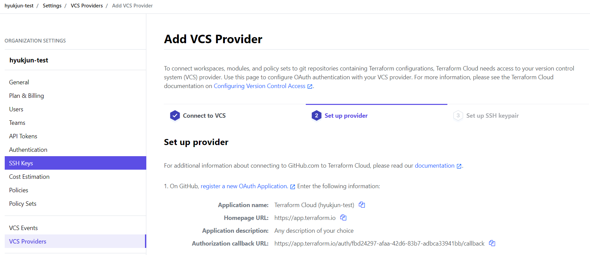
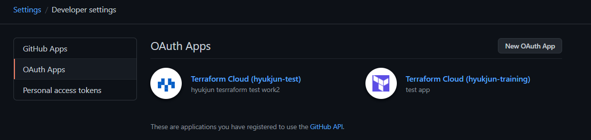
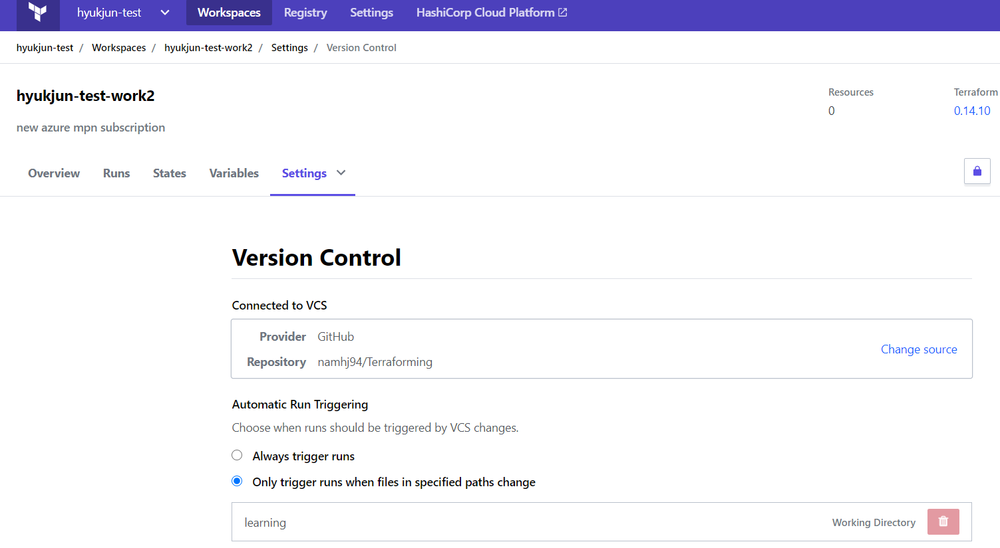
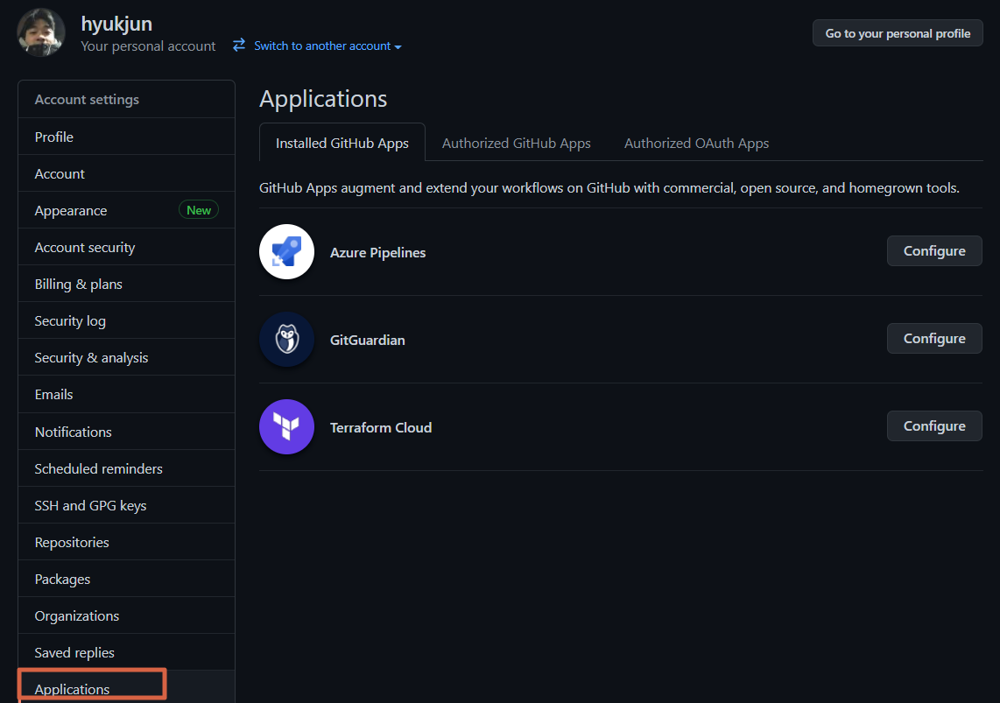

## Terraform Cloud 사용법
### 1. Azure Service Principal 등록
```
1. az login
2. az account list
3. az account set --subscription <SUBSCRIPTION_ID>
4. az ad sp create-for-rbac --name <CUSTOM_NAME> --role="Contributor" --scopes="/subscriptions/SUBSCRIPTION_ID"
5. 포털에서 해당 Service Principal 소유자 등록
```
### 2. Terraform Cloud Workspace 생성
테라폼 클라우드 포털 작업 or 코드에 선언
### 3. Terraform Cloud 환경변수 설정 & 로그인 토큰 준비
1. 환경변수 설정
```
위에서 앱등록한 Service Principal 정보 입력

ARM_SUBSCRIPTION_ID
ARM_CLIENT_ID
ARM_CLIENT_SECRET
ARM_TENANT_ID
```
2. 로그인 토큰 생성
```
User Setting -> Token
토큰 생성하여 로컬에 저장
```
### 4. Terraform Cloud 로그인 및 로컬 디렉토리 동기화
[기존에 디렉토리 init 후 사용중에서 테라폼클라우드로 상태 마이그레이션]
```
1. terraform login
2. terraform init -> yes 입력(상태파일을 새 백앤드에 복사한다는 메시지, yes를 입력하면 Terraform이 로컬머신에서 Terraform Cloud로 상태를 마이그레이션 합니다.)
3. [옵션] 로컬에 있는 terraform.tfstate 파일 제거
```
[디렉토리 초기 작업시]
```
1. 로컬 terraform 버전과 동일하게 configuration파일 작성 한 뒤, terraform init 진행
2. terraform cloud에 로그인 한 뒤, remote모드라면 terraform cloud의 테라폼 버전에 맞춰 configuration의 테라폼 버전 셋팅
3. terraform plan
```
## VCS 연결
### 방법 1. Github에 OAuth Application 등록(VCS Provider 지정)
Scope: Oraganization에 등록 후 Workspace에서 repo로 분할
<p>Terraform Cloud를 Github.com에 OAuth Application으로 등록한 뒤, 특정 Repository를 특정 Workspace에서 사용하도록 설정 가능(특정 repo의 특정 directory 설정 또한 가능)</p>

[등록방법]
  1. ORG선택 -> Settings -> VCS Providers 탭에서 기이드 되는 내용을 바탕으로 등록 혹은 Workspace -> Settings -> Version Control -> VCS Driven -> Github.com(Custom) 선택 -> ORG Settings로 화면 전환되고 등록 진행
  2. Workspace ->  Version Control -> 미리 OAuth 등록한 Github.com 선택 -> Repository선택 -> [선택]테라폼 Workdirectory 지정
  3. Github.com -> (User)Settings -> Developer settings -> OAuth Apps 에서 확인가능




### 방법 2. Github에  일반 Application 등록
Scope: 특정 Workspace로만 바로 진입 가능
<p>특정 Workspace 내에서 Version Control 등록 시 Github.com을 선택하면 일반 Application 등록 진행</p>

[등록방법]
  1. Workspace -> Settings -> Version Control -> Github.com 선택(Custom아님)
  2. Connection 진행시 특정 repo 선택 가능
  3. [선택] Terraform Working Directory 지정 
  4. Github.com -> (User)Settings -> Application 에서 확인 가능




## 참고사항
### team & governance 이상 구독 사용시 특징
1. 비용 예측: plan & apply시 Cost estimation 결과 출력
```
Plan: 7 to add, 0 to change, 0 to destroy.

Changes to Outputs:
  + public_ip_address = (known after apply)

------------------------------------------------------------------------

Cost estimation:

Waiting for cost estimate to complete...

Resources: 1 of 3 estimated
           $59.4/mo +$59.4
```
### 원격 변수 사용
로컬에있는 .tfvars 변수파일 네이밍<br>
Terraform Cloud 사용시 Terraform은 원격으로 실행되기 때문에 Terraform Cloud가 변수에 액세스 할 수 있도록 변수도 정의해야합니다. <br>
terraform.tfvars의 이름을 terraform.auto.tfvars로 바꿉니다. Terraform Cloud는 여러 * .auto.tfvars 파일을 자동으로 로드 할 수 있습니다.

### Terraform Cloud CLI 로그인 동작 방식 
terraform login을 통해 로그인 할 경우 미리 생성한 User의 Token값을 입력해야 함<br>
입력된 Token값은 로컬 환경에 저장되며, 앞으로 사용되는 테라폼 커맨드를 위해 사용됨<br>
Path:  ~/.terraform.d/credentials.tfrc.json <br>
결국, 테라폼 로그인 후 테라폼 커맨드를 사용할 때마다 이 곳에 저장된 토큰을 사용해서 테라폼 클라우드를 컨트롤 할 수 있게됨

### Execution mode
#### Remote
Terraform 실행환경 -> 테라폼 클라우드 <br>
Terraform 실행 시 클라우드의 테라폼 버전이 기준
- 구성 파일(.tf)과 Terraform Cloud의 Version이 다를경우
    - 구성 파일의 버전을 클라우드에 맞추거나
    - 클라드의 버전을 구성 파일에 맞추거나
- 로컬에 설치된(CLI) 테라폼 버전은 무시됨

#### Local
Terraform 실행환경 -> 로컬 CLI <br>
로컬 환경(CLI, Shell)에 설치된 테라폼 버전이 기준
- 구성 파일(.tf)에 설정된 버전과 로컬에 설치된 테라폼의 버전이 일치해야함
